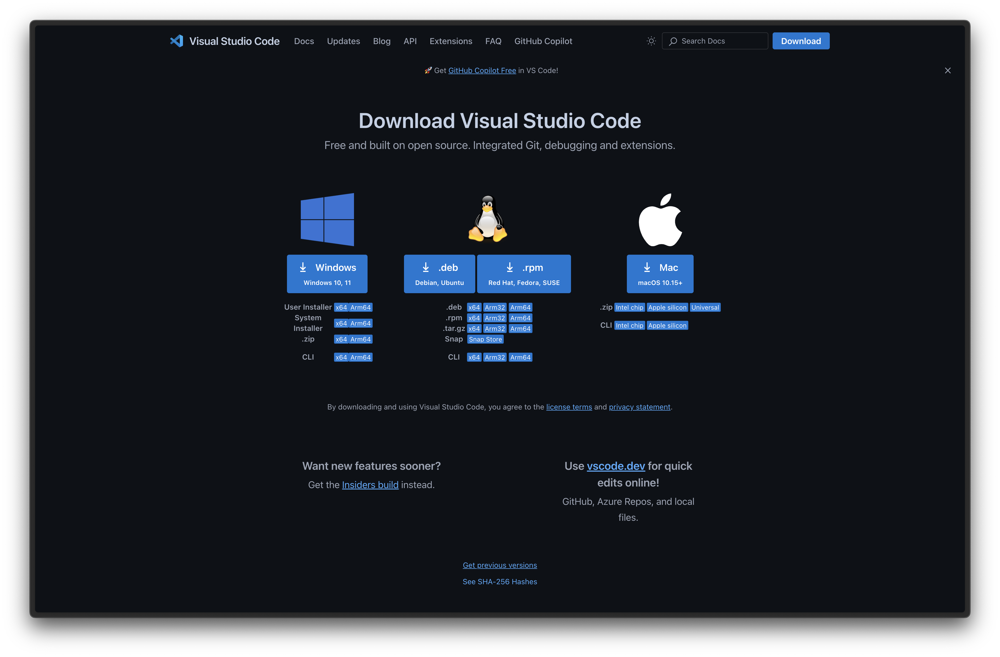
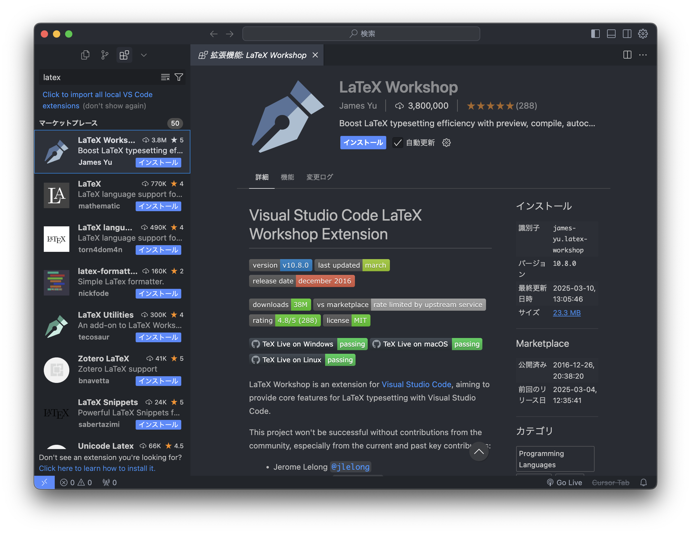
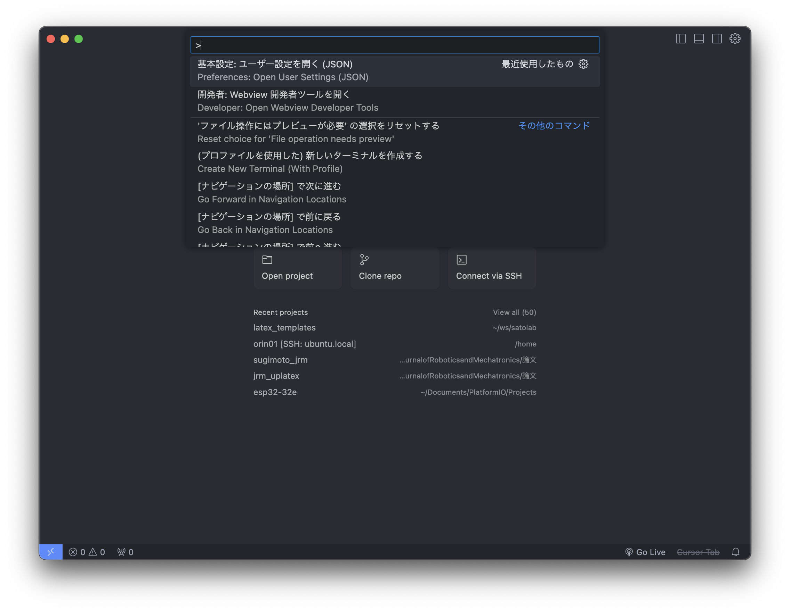
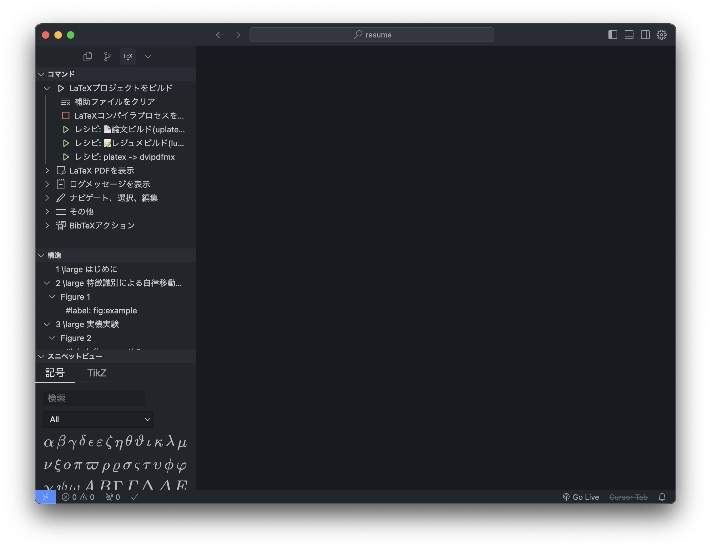

# LaTeX TEMPLATES
ファイル構成
```
.
├── Docs : README のための画像
├── README.md : このリポジトリについての説明
├── thesis : 卒論，修論用テンプレート
└── vscode_latex_settings.json : vscode でビルドするための設定ファイル
```

テスト環境
- macOS sonoma 15.3.1　@ MacBookPro M4

## インストール
### Tex live のインストール
[TeX WikiのHomebrew によるインストール](https://texwiki.texjp.org/?TeX%20Live%2FMac#texlive-install-pacman) に従ってインストールします．
#### ターミナルの開き方
Spotlight で「terminal」と入力して出てきた「ターミナル.app」をクリックします．
<p align="center">
  
  
</p>

#### Homebrewのインストール
無ければ，インストールしてください．
ある場合はこの手順はスキップしてください．
つぎの文字列（コマンドといいます）をターミナルにコピペしてください．
```shell
/bin/bash -c "$(curl -fsSL https://raw.githubusercontent.com/Homebrew/install/HEAD/install.sh)"
```

#### Tex Live インストール
```shell
brew install texlive
```

### このテンプレートのインストール
ターミナルを開きます．
次のコマンドでこのGitHub リポジトリを任意の場所にクローン（ダウンロード）してください．

```shell
git clone https://github.com/satokazlab/latex_templates.git
```

### VS Code のインストール
[VSCode のダウンロードページ](https://code.visualstudio.com/download)
から，Mac 版をダウンロードしてください．
ここで，intel 版とApple Silicon 版があるので注意してください．
<p align="center">
  
</p>

#### LaTeX Workshop 拡張機能のインストール
VScode の「拡張機能」を押して，検索窓に「latex 」と入力すると，「LaTeX Workshop」が出てきます．
青い「インストール」ボタンを押すと，インストールが完了します．
<p align="center">
  
</p>

#### ビルド設定
LaTeX Workshop を使って，LaTeX をビルドする「レシピ」を設定します．
`cmd` + `shift` + `p` を押して，コマンドパレットを表示して，「settings.json」と入力してください．
候補に出てきた，
```
基本設定：ユーザー設定を開く（JSON）
Preferences: Open User Settings (JSON)
```
を選択すると，`settings.json` が開きます．
この中に，[`vscode_latex_settings.json`](./vscode_latex_settings.json)ファイルの内容をコピペしてください．
<p align="center">
  
</p>

`.json` 形式のファイルでは，中括弧{} の中に記述していきます．
項目の区切りは，`,` を使いますので，`,` の抜けに注意してください．


## 使い方
tex ファイルを開くと，拡張機能が自動的に表示されます．
画像の左側にlatex Workshop のメニューが開き，ビルドレシピが表示されています．
このうち，レジュメビルドをクリックすると，ビルドされます．
または，cmd + option + B でもビルドできます．
<p align="center">
  
</p>

### 1. 論文の作成
[`thesis`](./thesis)は，卒業論文，修士論文を作成するテンプレートです．
表紙があり，章，節，項で構成されます．

### 2. レジュメの作成
[`resume`](./resume) 卒業論文，修士論文を要約したものです．
諮問要旨，予稿と呼ばることがあります．
卒業論文は1 ページ，修士論文は2 ページを作成します．

### TIPS
`settings.json` でつぎの`autoBuild`設定を`"never"`の部分を`onSave`に変更すると，変更を保存するたびにビルドが実行されるようになります．
```
"latex-workshop.latex.autoBuild.run": "never", // onSave: 保存 cmd+s でビルドされる
```


<!-- ### 3. レポートの作成 -->
<!-- 授業などでお使いください． -->
